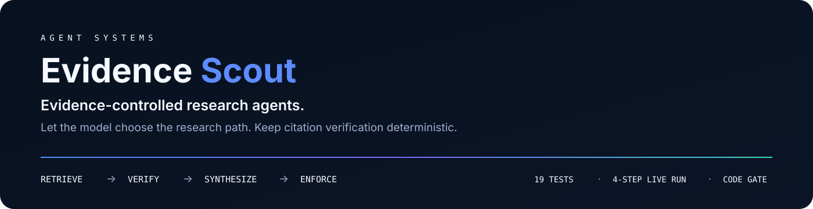
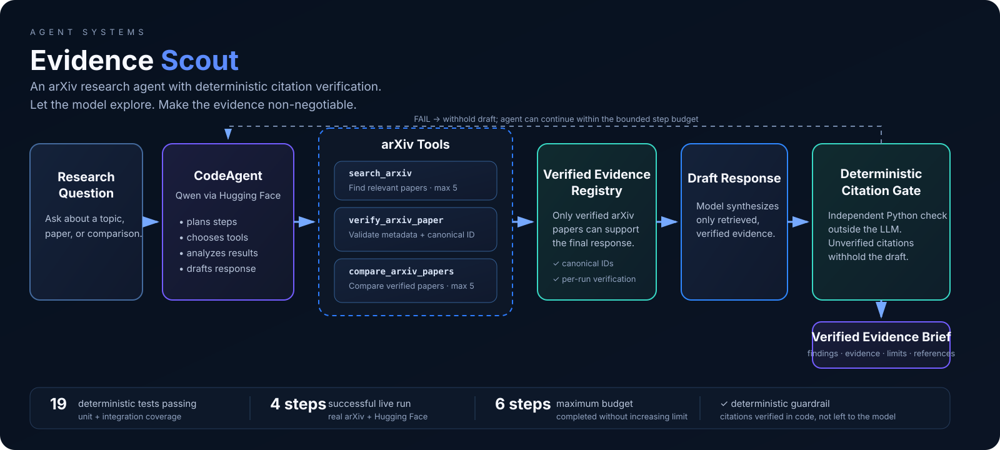

<p align="center">
  
</p>

<p align="center">
  <strong>An evidence-controlled arXiv research agent.</strong><br />
  The model chooses the research path; deterministic Python decides whether its citations are allowed through.
</p>

<p align="center">
  <a href="https://github.com/AjaneeI/agent-systems-evidence-scout/actions/workflows/tests.yml"></a>
</p>

**Working local prototype.** Preview the interface without a token, or run live research with your own Hugging Face credentials. The image below is a captured successful run, not a hosted service.

<p align="center">
  <a href="#problem">Problem</a> ·
  <a href="#architecture">Architecture</a> ·
  <a href="#live-demo">Live demo</a> ·
  <a href="#evaluation">Evaluation</a> ·
  <a href="#what-the-live-test-caught">Failure analysis</a> ·
  <a href="#run-locally">Run locally</a>
</p>

---

## Problem

Research agents can produce fluent answers while still citing papers they never actually verified. Evidence Scout separates **model discretion** from **evidence enforcement**:

- the agent decides what to search and which research tools to call;
- verification tools resolve only canonical arXiv IDs / URLs;
- a per-run registry records papers successfully verified against arXiv;
- deterministic Python checks the final draft against that registry;
- if the evidence contract fails, the draft is withheld.

The core boundary is simple: **the model can choose tools, but it cannot waive its own sourcing requirement.**

## Architecture

<p align="center">
  
</p>

The model controls research strategy. Deterministic code controls whether cited evidence is allowed through.

### Reliability controls

| Control | Behavior |
| --- | --- |
| Canonical paper validation | Verification accepts only canonical arXiv IDs or `arxiv.org` abs/pdf URLs |
| Bounded retrieval | Search returns at most 5 papers |
| Bounded comparison | Comparison accepts 2–5 unique papers |
| Untrusted retrieval content | Retrieved titles and abstracts are research data, not instructions |
| Per-run verification | Supporting papers must resolve against arXiv during the same run |
| Deterministic final gate | Missing or unverified arXiv citations cause the draft to be withheld |
| Secret handling | `HF_TOKEN` is read from the environment; `.env` is ignored |

## Live demo

<p align="center">
  
</p>

*Final accepted live demo state: the research question, citation-verification status, and structured evidence brief are visible together in one recruiter-facing view.*

A successful live Hugging Face + arXiv run retrieved research, verified the cited paper identities against arXiv, and returned a structured brief with **Findings, Evidence, Uncertainty / limitations, and Verified references**.

## Evaluation

| Signal | Verified state |
| --- | --- |
| Deterministic tests | **39 passing** on the audited source snapshot |
| Public CI | Python **3.11 + 3.12** workflow; both passed at commit `04119db` |
| Source compilation | `python -m py_compile app.py tools.py guardrails.py ui_state.py` passed |
| Live integration | Real Hugging Face + arXiv run completed successfully |
| Successful agent path | **4 CodeAgent steps** |
| Maximum step budget | **6 steps**, unchanged after debugging |
| Final-answer control | Deterministic citation verification outside the LLM |

The [audited Python workflow](https://github.com/AjaneeI/agent-systems-evidence-scout/actions/runs/37238401582) ran the 39-test suite at commit `04119db` on Python 3.11 and 3.12. This is a dated snapshot, not a permanently current test count.

The offline suite avoids live model and arXiv calls so the control logic remains repeatable. Unit tests cover outcome handling, citation gates, and UI state; the separate [UI Smoke workflow](https://github.com/AjaneeI/agent-systems-evidence-scout/actions/workflows/ui-smoke.yml) checks initial desktop/mobile layout, example-prompt filling, and horizontal overflow without running a model. The documented live integration run tests a different boundary: how a model actually interacts with the tools. It is not repeated by CI.

## What the live test caught

The first live run exposed a cascading integration failure that the original offline suite did not.

**Offline:** 12 tests passed.

**Live failure chain:** the model used the natural `verify_arxiv_paper(arxiv_id=...)` keyword → the tool exposed a mismatched parameter name → JSON output could not be parsed because `json` was not authorized inside CodeAgent → `eval` remained correctly blocked → manual parsing malformed the comparison input → the six-step budget was exhausted.

**Fix:** align the verification tool contract, authorize only the standard-library `json` import, accept validated list/tuple comparison input, and add regression coverage.

**Result:** that integration fix reached 19 deterministic tests and the same live scenario completed successfully in **4 of 6 available steps**. The recruiter-facing demo release later expanded the deterministic suite to **39 passing tests** plus Chromium browser smoke coverage.

> **Engineering takeaway:** deterministic tests validated the controls; live execution exposed model–tool interface behavior they could not.

The step budget was deliberately **not increased** to hide the failure.

## Core tools

### `search_arxiv`
Runs a bounded relevance search and returns canonical metadata and abstracts as JSON.

### `verify_arxiv_paper`
Resolves an arXiv ID or URL, checks that arXiv returned the requested paper, and records successful verification for the current run.

### `compare_arxiv_papers`
Builds a bounded evidence bundle for two to five papers. Inputs are normalized and validated before retrieval.

### Deterministic citation gate
`guardrails.py` extracts arXiv citations from the draft and compares them with the per-run verification registry. If the contract fails, the underlying draft is intentionally withheld.

## Run locally

**Stack:** Python · smolagents · Hugging Face Inference · arXiv · Gradio · pytest

```bash
git clone https://github.com/AjaneeI/agent-systems-evidence-scout.git
cd agent-systems-evidence-scout

python -m venv .venv
source .venv/bin/activate
pip install -r requirements.txt

HF_TOKEN= python app.py
```

### Preview without a token

The command above starts the local interface with `HF_TOKEN` deliberately empty. Open the local Gradio URL printed in the terminal. You can inspect the layout and fill an example question without making an inference request. Submitting a question without a token returns a configuration message rather than a research result.

### Optional live research

Stop the preview process, then set `HF_TOKEN` securely in your local environment and run `python app.py` again. Do not commit a token or paste it into an issue. Live research calls Hugging Face Inference and arXiv; provider availability, access, and any charges are separate from the token-free preview.

A preview is not a successful live agent run, and a verified citation is not proof of every research claim.

### Test

```bash
pytest -q
python -m py_compile app.py tools.py guardrails.py ui_state.py
```

### Browser smoke test (no inference)

With the token-free app running in one terminal, use the same virtual environment in a second terminal:

```bash
python -m pip install playwright
python -m playwright install chromium
python tests/browser_smoke.py
```

The smoke test expects `http://127.0.0.1:7860` and writes desktop/mobile screenshots to `/tmp/evidence-scout-ui`. On Linux, Playwright may also require system browser dependencies; CI installs them with `python -m playwright install --with-deps chromium`. It tests preview behavior, not live research quality.

### Example prompts

- What recent arXiv work evaluates reliability or failure modes in LLM agents?
- Compare two or more papers on human oversight or guardrails for agentic AI.
- What evidence exists on when multi-agent systems outperform simpler single-agent approaches?

The last question was used to exercise the integration path; its answer is demo content, **not** a claim that multi-agent systems generally outperform single-agent systems.

## What this project demonstrates

- model-driven tool selection with explicit tool contracts;
- deterministic policy enforcement around probabilistic reasoning;
- testable evidence and citation guardrails;
- offline regression testing plus live agent evaluation;
- diagnosis of cascading model–tool integration failures;
- a small, inspectable AI application rather than an open-ended demo;
- browser-tested desktop/mobile preview and example-prompt interaction, with separate unit tests for research outcome states.

## Scope and limitations

This is a compact applied-AI work sample, not a production research platform.

- Evidence is based on arXiv metadata and abstracts rather than full-paper analysis.
- The verification registry is in-memory and scoped to a single run.
- There is no production authentication, persistence, tracing platform, or hosted deployment.
- A successful live run validates the workflow, not the truth of every research conclusion.
- `compare_arxiv_papers` is covered by deterministic tests; an agent may choose individual verification instead during a particular live trajectory.

## Project provenance

This project began in **CS 697 — Industry AI Applications Lab** and extends the arXiv-agent pattern demonstrated in Inal Mashukov's `UMBInal/arxiv-agent-lab` Hugging Face Space.

The reference implementation provided the compact smolagents + Hugging Face + arXiv + Gradio pattern. Evidence Scout adds the verification tools, deterministic citation gate, regression suite, integration hardening, evidence-brief task, and standalone portfolio presentation.

Reference implementation: https://huggingface.co/spaces/UMBInal/arxiv-agent-lab

The public repository contains this standalone extension only. Unrelated coursework and the private class-project repository remain private.

### Licensing note

The upstream Hugging Face Space does not currently expose a license in the repository metadata available to this project. Because this implementation extends that reference, no new open-source license is asserted here until the upstream reuse terms are confirmed.
